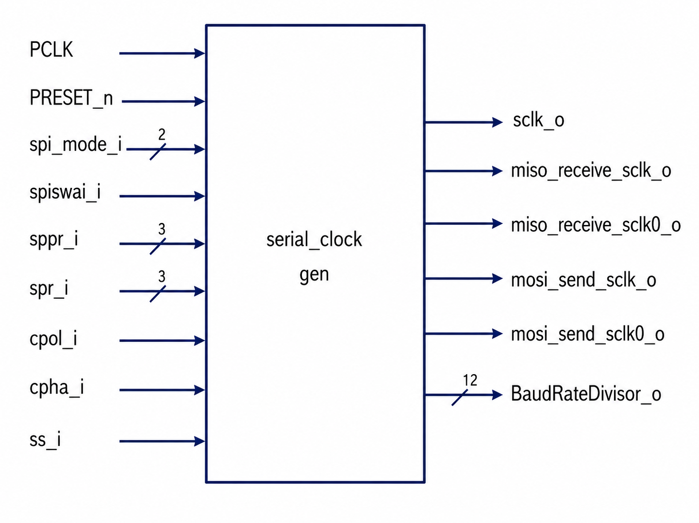

# Serial Clock Generator

## Overview

The Serial Clock Generator module generates the SPI Serial Clock (`sclk_o`) and timing control signals required for data transmission and reception in the SPI Master Core.

The module derives the SPI clock from the APB Peripheral Clock (`PCLK`) using programmable baud rate settings and supports all four standard SPI modes through Clock Polarity (CPOL) and Clock Phase (CPHA) configuration.

In addition to clock generation, the module produces dedicated timing pulses used by the SPI Shifter for:

- MOSI data transmission
- MISO data reception

This module acts as the timing backbone of the SPI Master Core.

---

## Features

✔ Programmable SPI Clock Frequency

✔ Configurable Baud Rate Divider

✔ CPOL Support

✔ CPHA Support

✔ SPI Modes 0, 1, 2, and 3

✔ MOSI Timing Pulse Generation

✔ MISO Timing Pulse Generation

✔ Slave Select Controlled Clock Generation

✔ Wait Mode Support

✔ Active-Low Asynchronous Reset

---

## Architecture



The Serial Clock Generator consists of three major functional blocks:

1. Baud Rate Divider
2. SPI Clock Generator
3. MOSI/MISO Timing Pulse Generator

---

## Inputs

| Signal | Width | Description |
|----------|----------|-------------|
| PCLK | 1 | APB Peripheral Clock |
| PRESET_n | 1 | Active-Low Reset |
| spi_mode_i | 2 | SPI Operating Mode |
| spiswai_i | 1 | SPI Stop In Wait Mode |
| sppr_i | 3 | Baud Rate Prescaler |
| spr_i | 3 | Baud Rate Divider |
| cpol_i | 1 | Clock Polarity |
| cpha_i | 1 | Clock Phase |
| ss_i | 1 | Slave Select |

---

## Outputs

| Signal | Width | Description |
|----------|----------|-------------|
| sclk_o | 1 | Generated SPI Clock |
| BaudRateDivisor_o | 12 | Calculated Baud Rate Divisor |
| miso_receive_sclk_o | 1 | Rising Edge Receive Pulse |
| miso_receive_sclk0_o | 1 | Falling Edge Receive Pulse |
| mosi_send_sclk_o | 1 | Rising Edge Transmit Pulse |
| mosi_send_sclk0_o | 1 | Falling Edge Transmit Pulse |

---

## Baud Rate Calculation

The SPI clock frequency is determined using the baud rate prescaler (`SPPR`) and divider (`SPR`).

The divisor is calculated as:

```text
BaudRateDivisor = (SPPR + 1) × 2^(SPR + 1)
```

The module internally uses:

```verilog
assign BaudRateDivisor =
       ((sppr_i + 1) * (2 ** (spr_i + 1)));
```

The generated clock toggle count is:

```verilog
assign BaudRateDivisor_o =
       BaudRateDivisor / 2;
```

### Example

For:

```text
SPPR = 0
SPR  = 2
```

Calculation:

```text
BaudRateDivisor
= (0 + 1) × 2^(2 + 1)

= 1 × 8

= 8
```

Therefore:

```text
BaudRateDivisor_o = 4
```

The SPI clock toggles every four PCLK cycles.

---

## SPI Mode Support

The module supports all four standard SPI modes.

| SPI Mode | CPOL | CPHA |
|-----------|------|------|
| Mode 0 | 0 | 0 |
| Mode 1 | 0 | 1 |
| Mode 2 | 1 | 0 |
| Mode 3 | 1 | 1 |

CPOL determines the idle state of the clock.

CPHA determines the edge used for data sampling and transmission.

---

## Internal Working

### 1. Clock Idle State Generation

The idle state of the SPI clock is determined by CPOL.

```verilog
assign pre_sclk_s =
       cpol_i ? 1'b1 : 1'b0;
```

#### CPOL = 0

```text
Idle Clock = LOW
```

#### CPOL = 1

```text
Idle Clock = HIGH
```

---

### 2. SPI Clock Generation

An internal counter (`count_s`) is incremented on every rising edge of `PCLK`.

```verilog
count_s <= count_s + 1'b1;
```

When:

```verilog
count_s == BaudRateDivisor_o - 1
```

the SPI clock toggles.

```verilog
sclk_o <= ~sclk_o;
```

This creates the required SPI serial clock frequency.

Clock generation occurs only when:

```text
ss_i = 0
SPI Enabled
Wait Mode Disabled
```

---

### 3. MISO Timing Pulse Generation

The module generates timing pulses indicating when incoming MISO data should be sampled.

Depending on the selected SPI mode:

#### Rising Edge Sampling

```verilog
miso_receive_sclk_o
```

is asserted.

#### Falling Edge Sampling

```verilog
miso_receive_sclk0_o
```

is asserted.

These signals are used by the SPI Shifter to capture incoming serial data.

---

### 4. MOSI Timing Pulse Generation

The module generates timing pulses indicating when MOSI data should be updated.

#### Rising Edge Transmission

```verilog
mosi_send_sclk_o
```

is asserted.

#### Falling Edge Transmission

```verilog
mosi_send_sclk0_o
```

is asserted.

These timing pulses ensure data is stable before the receiving device samples it.

---

## Integration with SPI Core

The Serial Clock Generator receives configuration information from:

- SPI APB Interface
- SPI Control Logic

and provides timing signals to:

- SPI Shifter

```text
SPI APB Interface
          |
          v
Serial Clock Generator
          |
          +----> sclk_o
          |
          +----> MOSI Timing Pulses
          |
          +----> MISO Timing Pulses
          |
          v
      SPI Shifter
```

---

## Functional Verification

A dedicated Verilog testbench was developed to verify:

- Reset Operation
- Baud Rate Calculation
- SPI Clock Generation
- CPOL Functionality
- CPHA Functionality
- SPI Mode Operation
- Slave Select Control
- Wait Mode Control
- MOSI Timing Pulses
- MISO Timing Pulses

### Simulation Tool

```text
ModelSim
```

### Verification Status

```text
PASS
```

---

## Lint Analysis

### Tool

```text
Synopsys VC SpyGlass
```

### Results

| Metric | Count |
|----------|----------|
| Fatals | 0 |
| Errors | 0 |
| Warnings | 0 |

### Status

```text
PASS ✅
```

---

## Logic Synthesis

### Tool

```text
Synopsys Design Compiler
```

### Outputs Generated

- Gate-Level Netlist
- Area Report
- RTL Schematic

### Status

```text
PASS ✅
```

---

## Repository Structure

```text
rtl/
├── serial_clock_generator.v

tb/
├── serial_clock_generator_tb.v

docs/
├── serial_clock_generator.md

waveforms/
├── serial_clock_generator/

images/
├── serial_clock_generator_architecture.png

reports/
├── lint/
└── synthesis/

netlist/
├── serial_clock_generator_netlist.v
```

---

## Design Flow

```text
RTL Design
      ↓
Testbench Development
      ↓
Functional Simulation
      ↓
Waveform Verification
      ↓
VC SpyGlass Linting
      ↓
Design Compiler Synthesis
      ↓
Gate-Level Netlist Generation
```

---

## Status

| Item | Status |
|---------|---------|
| RTL Design | ✅ Completed |
| Testbench | ✅ Completed |
| Functional Verification | ✅ Completed |
| Waveform Validation | ✅ Completed |
| Lint Analysis | ✅ Completed |
| Logic Synthesis | ✅ Completed |
| Gate-Level Netlist | ✅ Generated |
| Documentation | ✅ Completed |

---

## Conclusion

The Serial Clock Generator is responsible for producing the SPI serial clock and timing control pulses required for SPI communication. It supports programmable baud rates, all four SPI modes, configurable clock polarity and phase, and provides synchronization signals for the SPI Shifter. The module has been successfully verified through simulation, validated using lint analysis, and synthesized using Synopsys Design Compiler as part of the APB Based SPI Master Core project.
