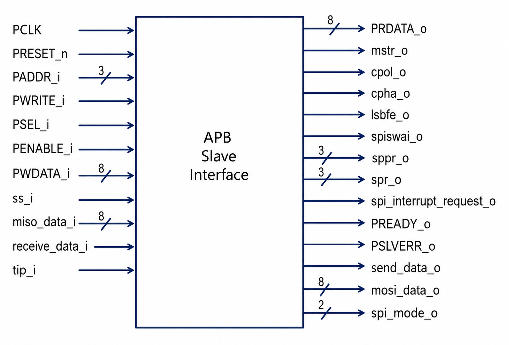
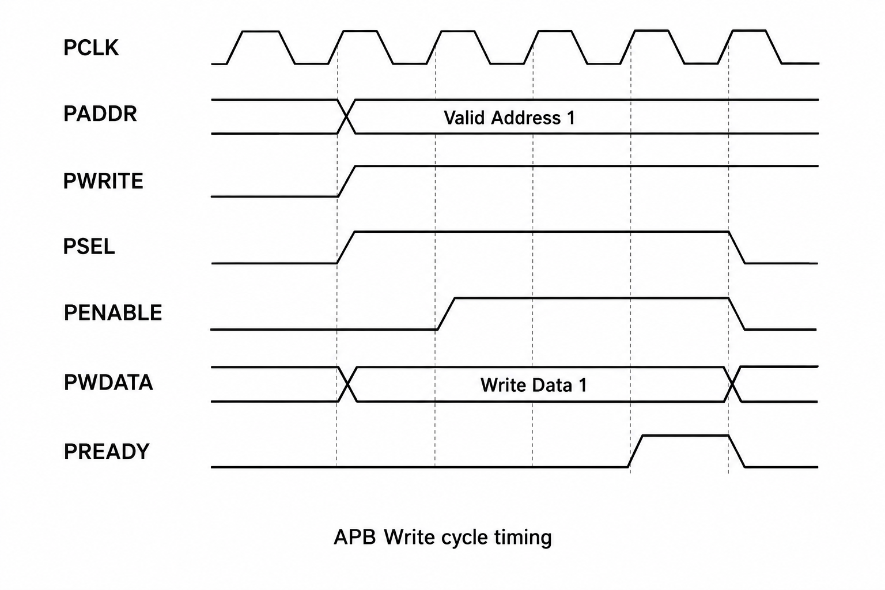
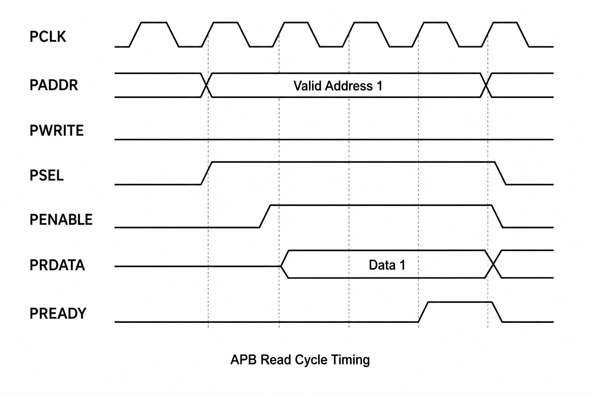

# SPI APB Interface

## Overview

The SPI APB Interface acts as the bridge between the APB bus and the SPI Master Core. It provides register-based configuration, transmit and receive data handling, status monitoring, and interrupt generation.

The module implements an APB Slave Interface that allows software to configure SPI operation, initiate data transfers, monitor transfer status, and access received data through memory-mapped registers.

---

# Features

- APB Slave Interface Implementation
- SPI Configuration Register Access
- APB Read and Write Transactions
- SPI Data Register Management
- SPI Status Monitoring
- Interrupt Generation Support
- RUN / WAIT / STOP Mode Control
- Mode Fault Detection
- Configurable SPI Parameters

---

# Architecture



### Functional Blocks

| Block | Function |
|---------|---------|
| APB FSM | Controls APB transaction flow |
| SPI_CR1 | SPI control configuration |
| SPI_CR2 | Additional SPI configuration |
| SPI_BR | Baud rate configuration |
| SPI_DR | SPI transmit/receive data register |
| SPI_SR | SPI status register |
| Interrupt Logic | Generates SPI interrupt requests |
| SPI Interface Logic | Connects APB registers to SPI Core |

---

# APB Register Map

| Address | Register | Description |
|----------|----------|-------------|
| 0x0 | SPI_CR1 | Control Register 1 |
| 0x1 | SPI_CR2 | Control Register 2 |
| 0x2 | SPI_BR | Baud Rate Register |
| 0x3 | SPI_SR | Status Register |
| 0x5 | SPI_DR | Data Register |

---

# Control Register 1 (SPI_CR1)

| Bit | Signal | Description |
|------|---------|-------------|
| 7 | SPIE | SPI Interrupt Enable |
| 6 | SPE | SPI Enable |
| 5 | SPTIE | Transmit Interrupt Enable |
| 4 | MSTR | Master Mode Select |
| 3 | CPOL | Clock Polarity |
| 2 | CPHA | Clock Phase |
| 1 | SSOE | Slave Select Output Enable |
| 0 | LSBFE | LSB First Enable |

---

# Control Register 2 (SPI_CR2)

| Bit | Signal | Description |
|------|---------|-------------|
| 4 | MODFEN | Mode Fault Enable |
| 1 | SPISWAI | SPI Stop In Wait Mode |

---

# Baud Rate Register (SPI_BR)

| Bits | Description |
|---------|-------------|
| [6:4] | SPPR Prescaler |
| [2:0] | SPR Divider |

---

# APB Write Transaction

The processor configures SPI registers and loads transmit data through APB write transactions.

## APB Write Timing Diagram



### Write Sequence

1. Master places a valid address on `PADDR`.
2. `PWRITE` is asserted HIGH indicating a write operation.
3. `PSEL` is asserted to select the SPI APB slave.
4. During the Setup Phase, `PENABLE` remains LOW.
5. Write data is driven on `PWDATA`.
6. During the Access Phase, `PENABLE` goes HIGH.
7. The slave asserts `PREADY`.
8. Data is written into the selected SPI register.

---

# APB Read Transaction

The processor reads SPI registers using APB read transactions.

## APB Read Timing Diagram



### Read Sequence

1. Master places the register address on `PADDR`.
2. `PWRITE` remains LOW indicating a read operation.
3. `PSEL` is asserted.
4. During the Setup Phase, `PENABLE` remains LOW.
5. During the Access Phase, `PENABLE` goes HIGH.
6. Register data appears on `PRDATA`.
7. The slave asserts `PREADY`.
8. The master samples the returned data.

---

# SPI Operating Modes

The APB Interface controls SPI operating states through Control Register settings.

| Mode | Description |
|--------|-------------|
| RUN | SPI actively performs transfers |
| WAIT | SPI temporarily paused |
| STOP | SPI operation halted |

Mode transitions are controlled by:

- SPE (SPI Enable)
- SPISWAI (Stop In Wait Mode)

---

# Status Register (SPI_SR)

| Bit | Signal | Description |
|------|---------|-------------|
| 7 | SPIF | Transfer Complete Flag |
| 5 | SPTEF | Transmit Buffer Empty Flag |
| 4 | MODF | Mode Fault Flag |

---

# Interrupt Generation

The SPI interrupt output is generated using the following status flags:

- SPIF (Transfer Complete)
- SPTEF (Transmit Buffer Empty)
- MODF (Mode Fault)

Interrupt generation is controlled through:

- SPIE
- SPTIE

configuration bits in SPI_CR1.

---

# Functional Verification

A dedicated Verilog testbench was developed to verify:

- APB Write Transactions
- APB Read Transactions
- Register Access Operations
- SPI Data Transfers
- Status Register Updates
- Interrupt Generation
- RUN / WAIT / STOP Mode Transitions
- Mode Fault Detection

Simulation Tool:

```text
ModelSim / QuestaSim
```

Verification Status:

```text
PASS ✅
```

---

# Generated Artifacts

### RTL Source

```text
rtl/
└── spi_apb_interface.v
```

### Testbench

```text
tb/
└── spi_apb_interface_tb.v
```

### Documentation Images

```text
images/
├── spi_apb_interface_architecture.png
├── apb_write_cycle.png
└── apb_read_cycle.png
```

---

# Conclusion

The SPI APB Interface provides a complete APB-compliant slave interface for configuring and controlling the SPI Master Core. It manages register access, data movement, status monitoring, interrupt generation, and SPI operating modes, enabling seamless communication between the processor and SPI subsystem.
