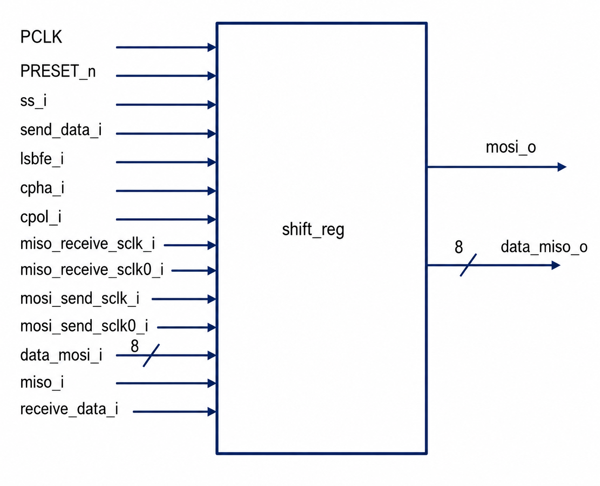

# SPI Shifter

## Overview

The SPI Shifter module is responsible for serial data transmission and reception in the SPI Master Core.

It performs:

- Parallel-to-Serial conversion for MOSI transmission
- Serial-to-Parallel conversion for MISO reception
- MSB First data transfers
- LSB First data transfers
- Support for all four SPI modes
- Synchronization using timing pulses generated by the Serial Clock Generator

The SPI Shifter acts as the data path block of the SPI Master and interfaces directly with the Serial Clock Generator and SPI Control Logic.

---

## Features

✔ 8-bit SPI Data Transfer

✔ MOSI Serial Transmission

✔ MISO Serial Reception

✔ MSB First Transfer Support

✔ LSB First Transfer Support

✔ SPI Modes 0, 1, 2, and 3

✔ Slave Select Controlled Operation

✔ Active-Low Asynchronous Reset

✔ Independent Transmit and Receive Logic

---

## Architecture



The SPI Shifter consists of two primary functional blocks:

1. Transmit Path (MOSI)
2. Receive Path (MISO)

---

## Inputs

| Signal | Width | Description |
|----------|----------|-------------|
| PCLK | 1 | APB Peripheral Clock |
| PRESET_n | 1 | Active-Low Reset |
| ss_i | 1 | Slave Select |
| send_data_i | 1 | Load Transmit Data |
| receive_data_i | 1 | Output Received Data |
| lsbfe_i | 1 | LSB First Enable |
| cpha_i | 1 | Clock Phase |
| cpol_i | 1 | Clock Polarity |
| mosi_send_sclk_i | 1 | Rising Edge MOSI Pulse |
| mosi_send_sclk0_i | 1 | Falling Edge MOSI Pulse |
| miso_receive_sclk_i | 1 | Rising Edge MISO Pulse |
| miso_receive_sclk0_i | 1 | Falling Edge MISO Pulse |
| data_mosi_i | 8 | Parallel Data To Transmit |
| miso_i | 1 | Serial Data Input |

---

## Outputs

| Signal | Width | Description |
|----------|----------|-------------|
| mosi_o | 1 | Serial Data Output |
| data_miso_o | 8 | Received Parallel Data |

---

## SPI Mode Support

The SPI Shifter supports all four SPI operating modes.

| SPI Mode | CPOL | CPHA |
|-----------|------|------|
| Mode 0 | 0 | 0 |
| Mode 1 | 0 | 1 |
| Mode 2 | 1 | 0 |
| Mode 3 | 1 | 1 |

The active timing pulse is selected using:

```verilog
assign use_sclk0 =
((!cpha_i && cpol_i) ||
 ( cpha_i && !cpol_i));
```

### Edge Selection

| use_sclk0 | Active Edge |
|------------|-------------|
| 0 | Rising Edge |
| 1 | Falling Edge |

---

## Internal Working

### 1. Transmit Data Loading

Whenever a new transmission is requested:

```verilog
send_data_i = 1
```

the transmit data is loaded into the internal transmit register.

```verilog
shift_register_s <= data_mosi_i;
```

Example:

```text
data_mosi_i = 8'hA5

Binary:

1010_0101
```

This data is stored and shifted out serially through MOSI.

---

### 2. MOSI Transmission Logic

The module transmits one bit at a time based on:

- SPI Mode
- Clock Edge
- Bit Order

#### LSB First

When:

```verilog
lsbfe_i = 1
```

Bits are transmitted as:

```text
Bit0 → Bit1 → Bit2 → Bit3 → Bit4 → Bit5 → Bit6 → Bit7
```

using counter:

```verilog
count_s
```

---

#### MSB First

When:

```verilog
lsbfe_i = 0
```

Bits are transmitted as:

```text
Bit7 → Bit6 → Bit5 → Bit4 → Bit3 → Bit2 → Bit1 → Bit0
```

using counter:

```verilog
count1_s
```

---

### 3. MISO Reception Logic

Incoming serial data from:

```verilog
miso_i
```

is captured into the receive register:

```verilog
temp_reg_s
```

using timing pulses generated by the Serial Clock Generator.

---

#### LSB First Reception

When:

```verilog
lsbfe_i = 1
```

received bits are stored as:

```text
temp_reg_s[0]
temp_reg_s[1]
temp_reg_s[2]
...
temp_reg_s[7]
```

using:

```verilog
count2_s
```

---

#### MSB First Reception

When:

```verilog
lsbfe_i = 0
```

received bits are stored as:

```text
temp_reg_s[7]
temp_reg_s[6]
temp_reg_s[5]
...
temp_reg_s[0]
```

using:

```verilog
count3_s
```

---

### 4. Received Data Output

After all eight bits are received:

```verilog
receive_data_i = 1
```

the received byte becomes available at:

```verilog
data_miso_o
```

```verilog
assign data_miso_o =
receive_data_i ?
temp_reg_s :
8'h00;
```

---

## Data Flow

### MOSI Transmission

```text
data_mosi_i
      |
      v
shift_register_s
      |
      v
Bit Selection Logic
      |
      v
mosi_o
```

### MISO Reception

```text
miso_i
      |
      v
Bit Capture Logic
      |
      v
temp_reg_s
      |
      v
data_miso_o
```

---

## Integration with SPI Core

The SPI Shifter receives timing pulses from the Serial Clock Generator.

```text
Serial Clock Generator
           |
           |
           v

     SPI Shifter
    /           \
   /             \
 MOSI           MISO
```

### Inputs From

- Serial Clock Generator
- SPI APB Interface
- SPI Control Logic

### Outputs To

- External SPI Slave
- SPI APB Interface

---

## Functional Verification

A dedicated Verilog testbench was developed to verify:

- Reset Operation
- MOSI Transmission
- MISO Reception
- MSB First Transfer
- LSB First Transfer
- SPI Mode 0
- SPI Mode 1
- SPI Mode 2
- SPI Mode 3
- Slave Select Operation

### Simulation Tool

```text
ModelSim
```

### Verification Status

```text
PASS
```

---

## Lint Analysis

### Tool

```text
Synopsys VC SpyGlass
```

### Results

| Metric | Count |
|----------|----------|
| Fatals | 0 |
| Errors | 0 |
| Warnings | 0 |

### Status

```text
PASS ✅
```

---

## Logic Synthesis

### Tool

```text
Synopsys Design Compiler
```

### Outputs Generated

- Gate-Level Netlist
- Area Report
- RTL Schematic

### Status

```text
PASS ✅
```

---

## Repository Structure

```text
rtl/
├── spi_shifter.v

tb/
├── spi_shifter_tb.v

docs/
├── spi_shifter.md

waveforms/
├── spi_shifter/

images/
├── spi_shifter_architecture.png

reports/
├── lint/
└── synthesis/

netlist/
├── spi_shifter_netlist.v
```

---

## Design Flow

```text
RTL Design
      ↓
Testbench Development
      ↓
Functional Simulation
      ↓
Waveform Verification
      ↓
VC SpyGlass Linting
      ↓
Design Compiler Synthesis
      ↓
Gate-Level Netlist Generation
```

---

## Status

| Item | Status |
|---------|---------|
| RTL Design | ✅ Completed |
| Testbench | ✅ Completed |
| Functional Verification | ✅ Completed |
| Waveform Validation | ✅ Completed |
| Lint Analysis | ✅ Completed |
| Logic Synthesis | ✅ Completed |
| Gate-Level Netlist | ✅ Generated |
| Documentation | ✅ Completed |

---

## Conclusion

The SPI Shifter module serves as the data transfer engine of the SPI Master Core. It performs parallel-to-serial conversion for MOSI transmission and serial-to-parallel conversion for MISO reception while supporting all SPI modes and bit-order configurations. The module has been successfully verified, lint-cleaned, synthesized, and integrated into the APB Based SPI Master Core.
