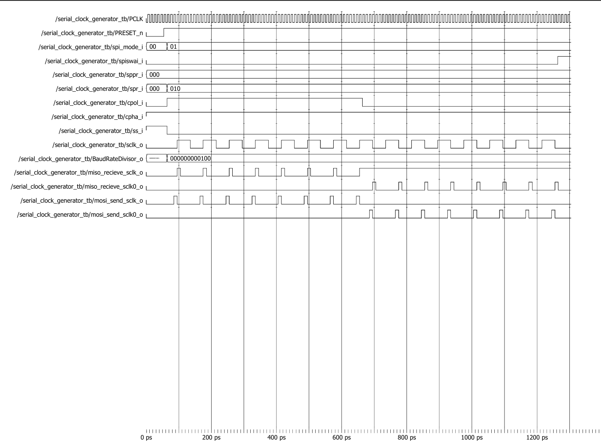

# Serial Clock Generator Waveform Analysis



## Test Configuration

| Parameter | Value |
|------------|---------|
| SPI Mode | 01 |
| SPPR | 0 |
| SPR | 2 |
| CPHA | 1 |
| CPOL | 1 → 0 |
| Slave Select | Active Low |
| SPISWAI | 0 |

---

## Waveform Explanation

### Step 1: Reset Phase

Initially `PRESET_n` is asserted low, resetting all internal counters and output signals.

After `PRESET_n` is released, the Serial Clock Generator becomes active and starts responding to the configured SPI settings.

---

### Step 2: SPI Configuration

The testbench configures:

```text
SPI_MODE = 01
SPPR     = 0
SPR      = 2
CPHA     = 1
CPOL     = 1
```

These settings determine the SPI clock polarity, phase, and baud-rate divisor.

---

### Step 3: Baud Rate Divisor Generation

The module calculates:

```text
BaudRateDivisor_o = 4
```

This value controls how frequently the generated SPI clock toggles relative to the system clock (`PCLK`).

The waveform shows the divisor becoming valid immediately after configuration.

---

### Step 4: Slave Select Assertion

When:

```text
ss_i = 0
```

the SPI bus becomes active.

The Serial Clock Generator starts producing SPI timing signals required by the SPI Shifter module.

---

### Step 5: SPI Clock Generation

The generated serial clock appears on:

```text
sclk_o
```

Since:

```text
CPOL = 1
```

the clock initially idles in the HIGH state.

The waveform shows periodic clock toggling according to the calculated baud-rate divisor.

---

### Step 6: Receive Timing Pulse Generation

The module generates:

```text
miso_receive_sclk_o
miso_receive_sclk0_o
```

These signals indicate the clock edges on which incoming MISO data should be sampled.

Only the appropriate receive pulse becomes active depending on the selected SPI mode.

---

### Step 7: Transmit Timing Pulse Generation

The module also generates:

```text
mosi_send_sclk_o
mosi_send_sclk0_o
```

These signals indicate the clock edges used by the SPI Shifter to transmit MOSI data.

The waveform confirms correct generation of transmit timing pulses.

---

### Step 8: CPOL Transition

During simulation, the testbench changes:

```text
CPOL = 1 → 0
```

As a result:

- The idle state of `sclk_o` changes
- Receive timing pulses shift accordingly
- Transmit timing pulses shift accordingly

The waveform confirms proper operation for both clock polarity settings.

---

### Step 9: SPISWAI Assertion

Towards the end of simulation:

```text
SPISWAI = 1
```

This requests the SPI module to enter wait mode.

Clock activity stops as expected, demonstrating correct SPISWAI functionality.

---

## Verification Results

| Feature | Status |
|----------|----------|
| Baud Rate Divisor Generation | ✅ PASS |
| SPI Clock Generation | ✅ PASS |
| CPOL = 1 Operation | ✅ PASS |
| CPOL = 0 Operation | ✅ PASS |
| Receive Clock Pulse Generation | ✅ PASS |
| Transmit Clock Pulse Generation | ✅ PASS |
| SPISWAI Functionality | ✅ PASS |

---

## Conclusion

The waveform confirms that the Serial Clock Generator correctly generates the SPI serial clock and associated transmit/receive timing pulses based on the configured baud-rate divisor, clock polarity, clock phase, and control settings. The module operates correctly across different CPOL configurations and successfully supports SPI timing generation for data transmission and reception.
