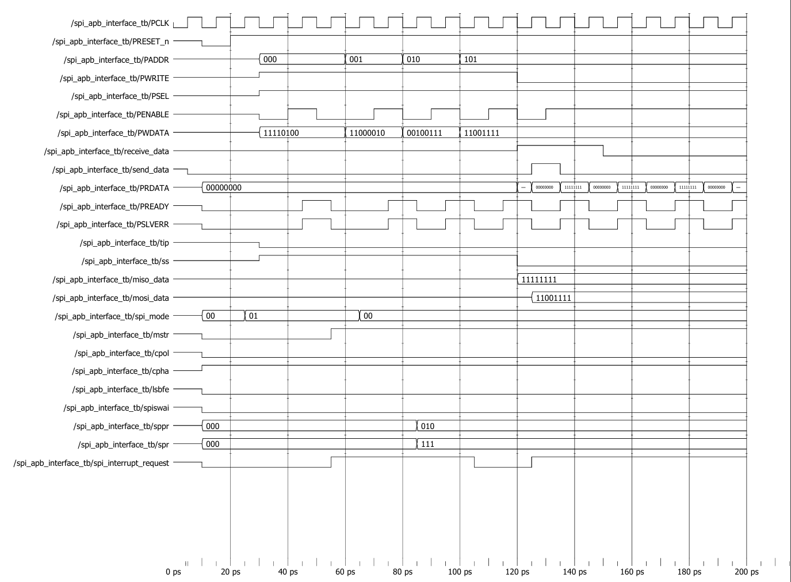

# SPI APB Interface Waveform Analysis



## Test Configuration

| Parameter | Value |
|------------|---------|
| APB Data Width | 8 Bits |
| APB Address Width | 3 Bits |
| CR1 Value | 8'b1111_0100 |
| CR2 Value | 8'b1100_0010 |
| BR Value | 8'b0010_0111 |
| Write Data | 8'hCF |
| Read Data | 8'hFF |

---

## Waveform Explanation

### Step 1: Reset Phase

Initially, `PRESET_n` is asserted low.

During reset:

- Internal control registers are cleared.
- Data registers are initialized.
- APB interface enters the idle state.

After reset is released, the APB interface is ready to accept transactions.

---

### Step 2: Configure Control Register 1 (CR1)

The processor performs an APB write transaction.

Address:

```text
PADDR = 3'b000
```

Data:

```text
PWDATA = 8'b1111_0100
```

APB protocol sequence:

```text
Setup Phase:
PSEL    = 1
PENABLE = 0

Access Phase:
PSEL    = 1
PENABLE = 1
```

The configuration is stored in Control Register 1.

---

### Step 3: Configure Control Register 2 (CR2)

The processor writes:

```text
PADDR  = 3'b001
PWDATA = 8'b1100_0010
```

This configures additional SPI operating parameters.

---

### Step 4: Configure Baud Rate Register (BR)

The processor writes:

```text
PADDR  = 3'b010
PWDATA = 8'b0010_0111
```

The baud rate configuration is forwarded to the Serial Clock Generator.

---

### Step 5: Write Transmit Data

The processor writes data to the SPI Data Register.

Address:

```text
PADDR = 3'b101
```

Data:

```text
PWDATA = 8'hCF
```

APB signals:

```text
PWRITE  = 1
PSEL    = 1
PENABLE = 1
```

The APB Interface stores the transmit byte and generates:

```text
send_data_o = 1
```

indicating that valid transmit data is available for the SPI Shifter.

---

### Step 6: SPI Receive Data Available

The testbench emulates the SPI core by providing:

```text
miso_data = 8'hFF
```

and asserting:

```text
receive_data = 1
```

This indicates that a complete SPI receive transaction has occurred.

The APB Interface captures:

```text
data_miso_i = 8'hFF
```

and stores it internally.

---

### Step 7: APB Read Transaction

The processor reads the SPI Data Register.

Address:

```text
PADDR = 3'b101
```

Control signals:

```text
PWRITE  = 0
PSEL    = 1
PENABLE = 1
```

The APB Interface places the received data on:

```text
PRDATA
```

Result:

```text
PRDATA = 8'hFF
```

This confirms successful SPI receive-data storage and APB read-back operation.

---

### Step 8: Transaction Completion

The testbench deasserts:

```text
receive_data = 0
```

The APB transaction completes successfully and the interface returns to the idle state.

---

## APB Transaction Flow

```text
Reset
  |
  v
Write CR1
  |
  v
Write CR2
  |
  v
Write BR
  |
  v
Write Data Register
  |
  v
send_data_o Asserted
  |
  v
Receive SPI Data
  |
  v
Store Received Byte
  |
  v
Read Data Register
  |
  v
PRDATA = 8'hFF
```

---

## Key Signals Observed

| Signal | Description |
|----------|-------------|
| PSEL | APB Slave Selection |
| PENABLE | APB Access Phase Indicator |
| PWRITE | Read/Write Control |
| PADDR | Register Address |
| PWDATA | Write Data Bus |
| PRDATA | Read Data Bus |
| send_data_o | Indicates TX Data Available |
| receive_data_i | Indicates RX Data Available |
| data_miso_i | Received SPI Data |
| data_mosi_o | Transmit SPI Data |

---

## Verification Results

| Feature | Status |
|----------|----------|
| APB Write Transaction | ✅ PASS |
| APB Read Transaction | ✅ PASS |
| Control Register Programming | ✅ PASS |
| Baud Register Programming | ✅ PASS |
| Data Register Write | ✅ PASS |
| Data Register Read | ✅ PASS |
| Receive Data Capture | ✅ PASS |
| send_data_o Generation | ✅ PASS |

---

## Expected vs Observed Results

| Item | Expected | Observed |
|--------|----------|----------|
| Written TX Data | 8'hCF | 8'hCF |
| Received SPI Data | 8'hFF | 8'hFF |
| APB Read Data | 8'hFF | 8'hFF |

---

## Conclusion

The waveform verifies correct operation of the SPI APB Interface. The module successfully performs APB write transactions for SPI configuration, transfers transmit data to the SPI core through `send_data_o`, captures received SPI data, and returns the received byte through a standard APB read transaction. The waveform confirms proper APB protocol compliance and successful integration between the APB bus and SPI core.
