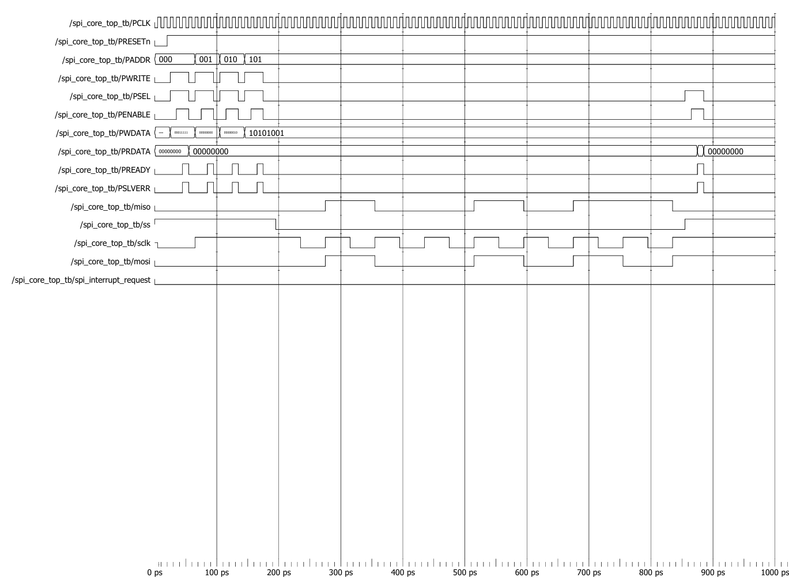

# SPI Core Top Waveform Analysis



## Test Configuration

| Parameter | Value |
|------------|---------|
| SPI Mode | Master Mode |
| CPOL | 0 |
| CPHA | 1 |
| LSBFE | 0 (MSB First) |
| Baud Rate Register | 8'h02 |
| Transmit Data | 8'hA9 |
| Receive Data | 8'h96 |

---

## Overview

This simulation verifies the complete APB-based SPI Master Core.

The testbench performs:

1. APB configuration of SPI registers
2. Transmission of data through MOSI
3. Reception of data through MISO
4. Readback of received data through the APB interface

The waveform demonstrates the integration of:

- APB Interface
- Serial Clock Generator
- SPI Shifter
- Slave Select Logic
- SPI Control Logic

---

## Waveform Explanation

### Step 1: Reset Phase

Initially:

```text
PRESET_n = 0
```

All SPI registers and internal control logic are reset.

After 20 ns:

```text
PRESET_n = 1
```

The SPI Core becomes operational.

---

### Step 2: SPI Configuration Through APB

The processor configures the SPI Core using APB write transactions.

#### Control Register 1 (CR1)

```text
Address = 0x0
Data    = 0x1F
```

This enables:

```text
SPI Enable
Master Mode
CPHA = 1
CPOL = 0
MSB First Transfer
```

---

#### Control Register 2 (CR2)

```text
Address = 0x1
Data    = 0x00
```

Additional SPI control bits remain disabled.

---

#### Baud Rate Register (BR)

```text
Address = 0x2
Data    = 0x02
```

This value is used by the Serial Clock Generator to derive the SPI clock frequency.

---

### Step 3: Load Transmit Data

The processor writes:

```text
Address = 0x5
Data    = 0xA9
```

Binary representation:

```text
0xA9 = 1010_1001
```

The APB Interface stores this value into the SPI Data Register.

The SPI Shifter loads the transmit data and prepares for transmission.

---

### Step 4: Slave Select Assertion

The SPI Core automatically asserts:

```text
ss = 0
```

This selects the external SPI slave and indicates the beginning of the SPI transaction.

---

### Step 5: SPI Clock Generation

The Serial Clock Generator begins generating:

```text
sclk
```

based on the configured baud-rate settings.

Since:

```text
CPOL = 0
CPHA = 1
```

the clock idles LOW and data transfer occurs according to SPI Mode 1 timing.

---

### Step 6: MOSI Transmission

The SPI Shifter transmits:

```text
0xA9
```

MSB-first sequence:

```text
1 → 0 → 1 → 0 → 1 → 0 → 0 → 1
```

These bits appear on:

```text
mosi
```

synchronized with the generated SPI clock.

---

### Step 7: MISO Reception

The testbench emulates an SPI slave.

The slave sends:

```text
0x96
```

Binary representation:

```text
0x96 = 1001_0110
```

MSB-first sequence:

```text
1 → 0 → 0 → 1 → 0 → 1 → 1 → 0
```

The SPI Shifter samples these bits through:

```text
miso
```

and stores them in the receive register.

---

### Step 8: End of SPI Transfer

After eight clock cycles:

```text
ss = 1
```

The SPI transaction is completed.

The received byte is now available inside the SPI Data Register.

---

### Step 9: APB Read Operation

The processor performs an APB read transaction.

```text
Address = 0x5
```

The SPI Core returns:

```text
PRDATA = 0x96
```

confirming successful reception of the SPI data.

---

## Complete Data Flow

```text
APB Write CR1
      |
      v
APB Write CR2
      |
      v
APB Write BR
      |
      v
APB Write SPI_DR (0xA9)
      |
      v
Assert Slave Select
      |
      v
Generate SPI Clock
      |
      v
Transmit 0xA9 on MOSI
      |
      v
Receive 0x96 on MISO
      |
      v
Store Received Data
      |
      v
APB Read SPI_DR
      |
      v
PRDATA = 0x96
```

---

## Key Signals Observed

| Signal | Description |
|----------|-------------|
| ss | Slave Select |
| sclk | SPI Clock |
| mosi | Master Out Slave In |
| miso | Master In Slave Out |
| PADDR | APB Address |
| PWDATA | APB Write Data |
| PRDATA | APB Read Data |
| PSEL | APB Select |
| PENABLE | APB Access Enable |
| PWRITE | APB Read/Write Control |

---

## Verification Results

| Feature | Status |
|----------|----------|
| APB Register Configuration | ✅ PASS |
| SPI Clock Generation | ✅ PASS |
| Slave Select Generation | ✅ PASS |
| MOSI Transmission | ✅ PASS |
| MISO Reception | ✅ PASS |
| Data Register Write | ✅ PASS |
| Data Register Read | ✅ PASS |
| Complete SPI Transaction | ✅ PASS |

---

## Expected vs Observed Results

| Item | Expected | Observed |
|--------|----------|----------|
| MOSI Data | 0xA9 | 0xA9 |
| MISO Data | 0x96 | 0x96 |
| APB Read Data | 0x96 | 0x96 |

---

## Conclusion

The waveform confirms successful operation of the complete APB-Based SPI Master Core. The APB Interface correctly configures the SPI registers, the Serial Clock Generator produces the required SPI clock, the SPI Shifter transmits and receives serial data correctly, and the received data is successfully returned to the processor through an APB read transaction.
