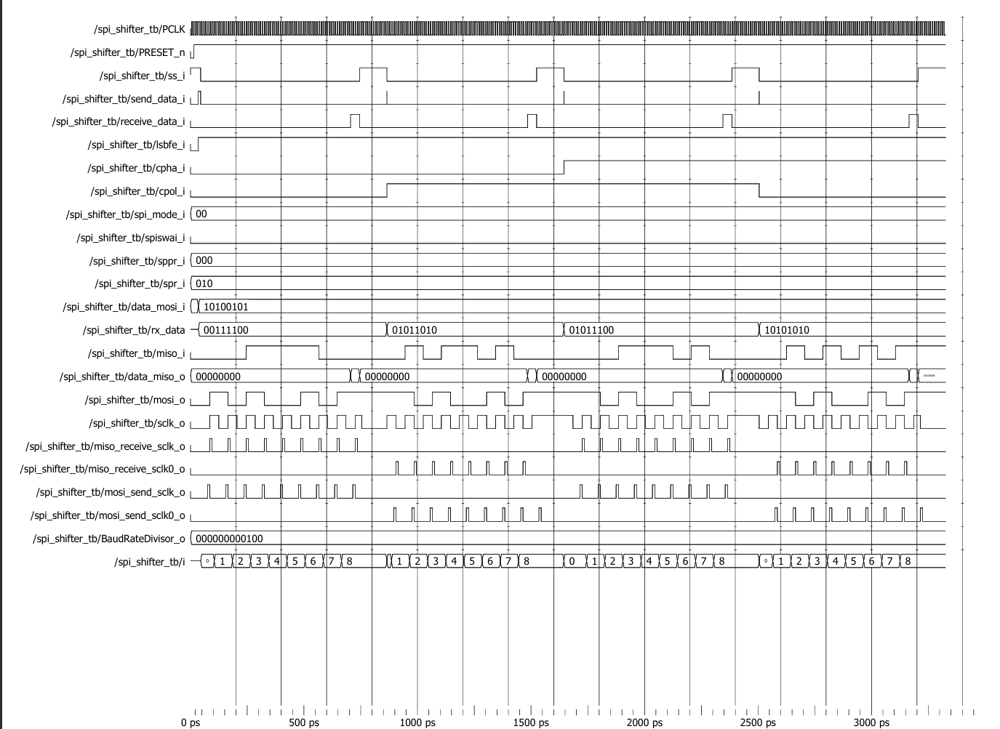

# SPI Shifter Waveform Analysis



## Test Configuration

| Parameter | Value |
|------------|---------|
| TX Data | 8'hA5 |
| Test 1 RX Data | 8'h3C |
| Test 2 RX Data | 8'h5A |
| Test 3 RX Data | 8'h5C |
| Test 4 RX Data | 8'hAA |
| Baud Rate Divisor | 4 |
| SPI Modes Tested | Mode 0, 1, 2, 3 |
| Bit Order | LSB First |

---

## Overview

This simulation verifies the SPI Shifter module responsible for:

- Parallel-to-Serial conversion (MOSI transmission)
- Serial-to-Parallel conversion (MISO reception)
- LSB First data transfer
- SPI Mode 0 operation
- SPI Mode 1 operation
- SPI Mode 2 operation
- SPI Mode 3 operation

The Serial Clock Generator is instantiated in the testbench to provide the required SPI timing signals.

---

## Waveform Explanation

### Step 1: Reset Phase

Initially:

```text
PRESET_n = 0
```

The SPI Shifter resets all internal registers.

During reset:

```text
shift_register = 0
receive_register = 0
mosi_o = 0
```

After reset is released:

```text
PRESET_n = 1
```

the SPI Shifter becomes ready for data transfer.

---

### Step 2: Configure SPI Mode

The testbench configures:

```text
CPOL
CPHA
LSBFE
```

for each test case.

The following SPI modes are verified:

| Test | CPOL | CPHA | Mode |
|--------|------|------|------|
| 1 | 0 | 0 | Mode 0 |
| 2 | 1 | 0 | Mode 2 |
| 3 | 1 | 1 | Mode 3 |
| 4 | 0 | 1 | Mode 1 |

All transfers are performed in:

```text
LSB First Mode
```

---

### Step 3: Load Transmit Data

The testbench loads:

```text
data_mosi_i = 8'hA5
```

Binary representation:

```text
8'hA5 = 1010_0101
```

The signal:

```text
send_data_i = 1
```

loads the transmit shift register.

---

### Step 4: Slave Select Assertion

The testbench asserts:

```text
ss_i = 0
```

which starts the SPI transaction.

Once Slave Select becomes active:

- MOSI transmission begins
- MISO reception begins
- SPI clock pulses are generated

---

### Step 5: MOSI Transmission

The SPI Shifter transmits:

```text
8'hA5
```

Since:

```text
LSBFE = 1
```

the bit sequence transmitted on MOSI is:

```text
1 → 0 → 1 → 0 → 0 → 1 → 0 → 1
```

These bits appear sequentially on:

```text
mosi_o
```

synchronized with the generated SPI clock.

---

### Step 6: MISO Reception

The testbench emulates an SPI slave and drives data on:

```text
miso_i
```

depending on the selected test case.

#### Test 1

```text
RX Data = 8'h3C
Binary  = 0011_1100
```

LSB-first sequence:

```text
0 → 0 → 1 → 1 → 1 → 1 → 0 → 0
```

---

#### Test 2

```text
RX Data = 8'h5A
Binary  = 0101_1010
```

---

#### Test 3

```text
RX Data = 8'h5C
Binary  = 0101_1100
```

---

#### Test 4

```text
RX Data = 8'hAA
Binary  = 1010_1010
```

The SPI Shifter samples these bits and stores them into the receive shift register.

---

### Step 7: Receive Data Capture

After all 8 bits are received:

```text
receive_data_i = 1
```

The received byte is transferred to:

```text
data_miso_o
```

For example, in Test 1:

```text
data_miso_o = 8'h3C
```

confirming successful serial-to-parallel conversion.

---

### Step 8: End of Transfer

After the byte transfer completes:

```text
ss_i = 1
```

The SPI transaction ends and the SPI Shifter returns to the idle state.

---

## Example Transfer (Mode 0)

### Configuration

```text
CPOL  = 0
CPHA  = 0
LSBFE = 1

TX Data = 8'hA5
RX Data = 8'h3C
```

### MOSI Transfer

```text
8'hA5 = 1010_0101

LSB First:

1 → 0 → 1 → 0 → 0 → 1 → 0 → 1
```

### MISO Transfer

```text
8'h3C = 0011_1100

LSB First:

0 → 0 → 1 → 1 → 1 → 1 → 0 → 0
```

### Result

```text
data_miso_o = 8'h3C
```

The waveform confirms successful simultaneous MOSI transmission and MISO reception.

---

## Verification Results

| Feature | Status |
|----------|----------|
| Reset Operation | ✅ PASS |
| MOSI Transmission | ✅ PASS |
| MISO Reception | ✅ PASS |
| LSB First Transfer | ✅ PASS |
| SPI Mode 0 | ✅ PASS |
| SPI Mode 1 | ✅ PASS |
| SPI Mode 2 | ✅ PASS |
| SPI Mode 3 | ✅ PASS |
| Slave Select Operation | ✅ PASS |

---

## Expected vs Observed Results

| Test | Expected RX Data | Observed RX Data |
|--------|------------------|------------------|
| Mode 0 | 8'h3C | 8'h3C |
| Mode 2 | 8'h5A | 8'h5A |
| Mode 3 | 8'h5C | 8'h5C |
| Mode 1 | 8'hAA | 8'hAA |

---

## Conclusion

The waveform verifies correct operation of the SPI Shifter module. The module successfully performs MOSI transmission and MISO reception while supporting LSB-first transfers and all four standard SPI modes. The received data matches the expected values for every test case, confirming correct serial-to-parallel and parallel-to-serial conversion functionality.
