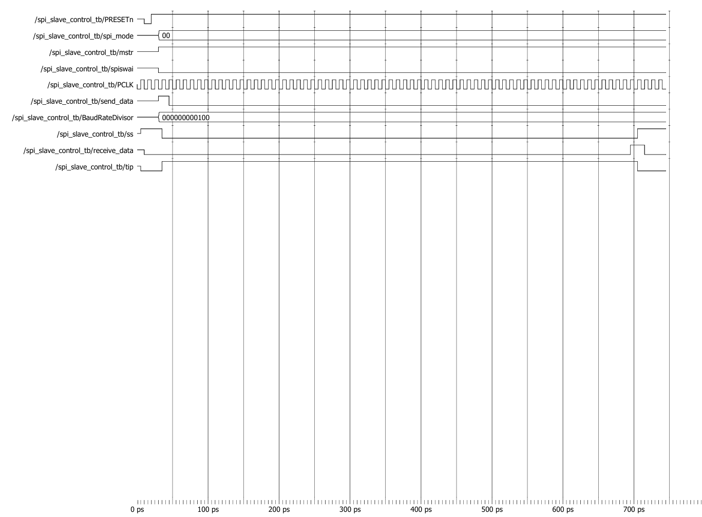

# SPI Slave Control Waveform Analysis



## Test Configuration

| Parameter | Value |
|------------|---------|
| SPI Mode | 2'b00 |
| Master Mode | Enabled |
| Stop Mode | Disabled |
| Baud Rate Divisor | 12'h004 |
| Send Data | Asserted |
| Clock Frequency | 100 MHz |

---

## Overview

The SPI Slave Control module manages:

- Slave Select (`ss_o`) generation
- Transfer-In-Progress (`tip_o`) indication
- Receive Data (`receive_data_o`) generation
- SPI transfer timing control

The module ensures that the SPI slave remains selected for the entire transfer duration and automatically deselects the slave once the transaction completes.

---

## Waveform Explanation

### Step 1: Reset Phase

Initially:

```text
PRESET_n = 0
```

The module resets all internal counters and outputs.

During reset:

```text
ss_o           = 1
tip_o          = 0
receive_data_o = 0
```

The SPI controller remains idle.

After reset is released:

```text
PRESET_n = 1
```

the module becomes ready for operation.

---

### Step 2: Master Mode Configuration

The testbench configures:

```text
spi_mode_i         = 2'b00
mstr_i             = 1
spiswai_i          = 0
BaudRateDivisor_i  = 12'h004
```

Meaning:

- SPI operates in Master Mode
- Stop mode is disabled
- Slave selection timing is derived from the baud-rate divisor

---

### Step 3: Start Transfer Request

The testbench asserts:

```text
send_data_i = 1
```

This indicates that a new SPI transfer is requested.

At this point the Slave Control module:

- Starts the transfer timer
- Asserts Slave Select
- Sets Transfer-In-Progress

---

### Step 4: Slave Select Assertion

The module drives:

```text
ss_o = 0
```

Active-low slave select indicates that the SPI slave is selected.

The waveform shows:

```text
send_data_i ↑
        |
        v
ss_o = 0
```

The SPI slave remains selected throughout the transfer duration.

---

### Step 5: Transfer-In-Progress Indication

When the transfer begins:

```text
tip_o = 1
```

This signal indicates that an SPI transaction is currently active.

The Transfer-In-Progress signal remains asserted while:

```text
Transfer Counter < BaudRateDivisor × 16
```

---

### Step 6: Transfer Timing Control

The transfer duration is determined using:

```text
Transfer Time = BaudRateDivisor × 16
```

For this test:

```text
BaudRateDivisor = 4
```

Therefore:

```text
Transfer Length = 4 × 16
                = 64 clock counts
```

The waveform shows the slave remaining selected during this interval.

---

### Step 7: Receive Data Indication

At the end of the transfer:

```text
receive_data_o = 1
```

This pulse informs the SPI APB Interface that a complete byte has been received and is ready for processing.

The waveform shows a receive-data pulse immediately after the transfer completes.

---

### Step 8: Transfer Completion

After the transfer timer expires:

```text
tip_o = 0
```

indicating that the SPI transaction has finished.

---

### Step 9: Slave Deselect

The module automatically releases the slave:

```text
ss_o = 1
```

The SPI bus returns to the idle state.

The waveform sequence becomes:

```text
send_data_i
      |
      v

ss_o ↓
tip_o ↑

Transfer Active

receive_data_o ↑

tip_o ↓
ss_o ↑
```

---

## Example Transaction

### Configuration

```text
SPI Mode          = 00
Master Mode       = Enabled
Baud Rate Divisor = 4
Stop Mode         = Disabled
```

### Transfer Request

```text
send_data_i = 1
```

### Module Response

```text
ss_o  = 0
tip_o = 1
```

### Transfer Duration

```text
4 × 16 = 64 clock cycles
```

### Transfer Completion

```text
receive_data_o = 1
tip_o          = 0
ss_o           = 1
```

This confirms successful slave selection and transaction control.

---

## Signal Summary

| Signal | Description |
|----------|-------------|
| send_data_i | Start Transfer Request |
| ss_o | Active-Low Slave Select |
| tip_o | Transfer In Progress |
| receive_data_o | Transfer Complete Indication |
| BaudRateDivisor_i | Transfer Timing Control |
| mstr_i | Master Mode Enable |
| spiswai_i | Stop Mode Control |

---

## Verification Results

| Feature | Status |
|----------|----------|
| Reset Operation | ✅ PASS |
| Slave Select Generation | ✅ PASS |
| Transfer-In-Progress Generation | ✅ PASS |
| Receive Data Pulse Generation | ✅ PASS |
| Transfer Timing Control | ✅ PASS |
| Master Mode Operation | ✅ PASS |

---

## Expected vs Observed Results

| Item | Expected | Observed |
|--------|----------|----------|
| ss_o Assertion | Yes | Yes |
| tip_o Assertion | Yes | Yes |
| receive_data_o Pulse | Yes | Yes |
| Slave Deselect After Transfer | Yes | Yes |

---

## Conclusion

The waveform verifies correct operation of the SPI Slave Control module. Upon receiving a transfer request, the module correctly selects the slave device, asserts the transfer-in-progress signal, maintains the transfer for the required baud-rate-based duration, generates a receive-data indication, and finally deselects the slave after transaction completion.
